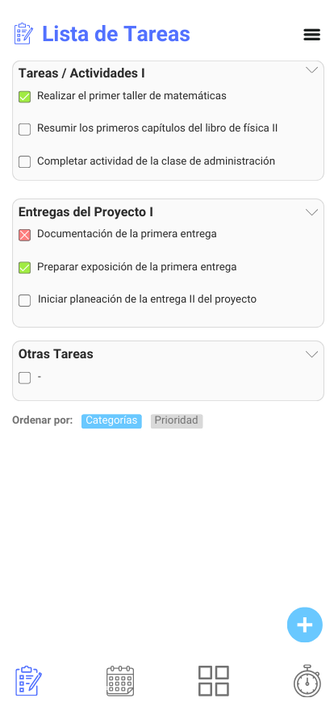
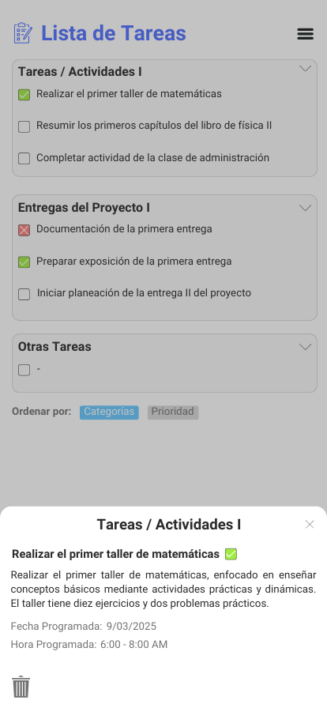
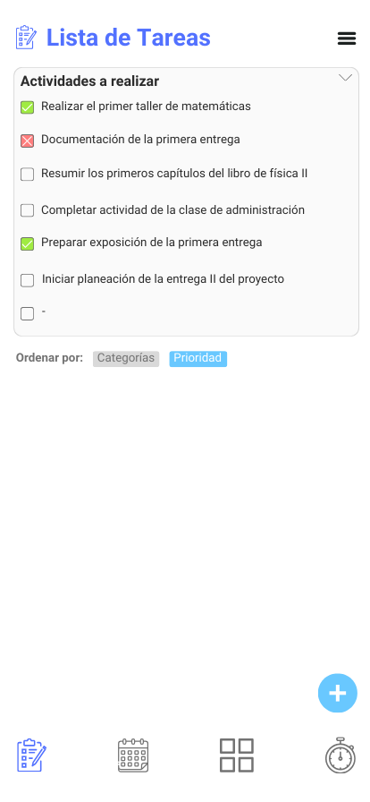
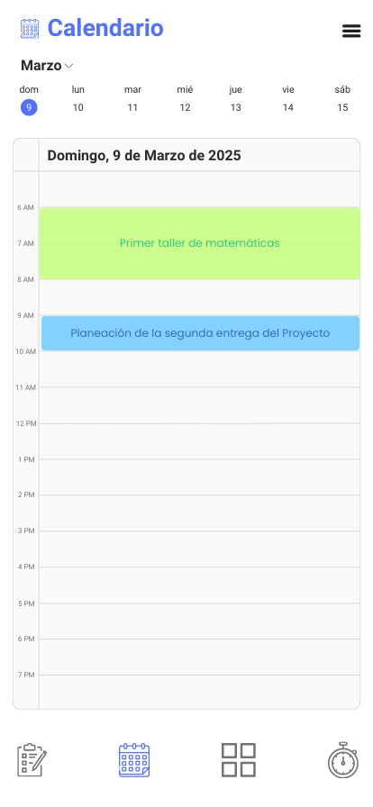
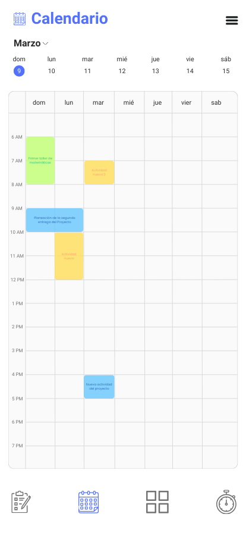
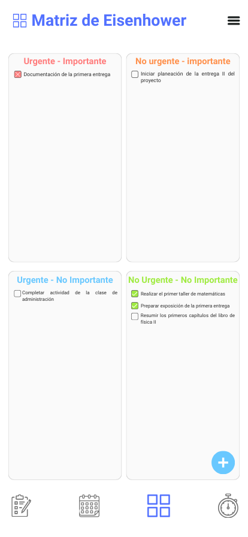
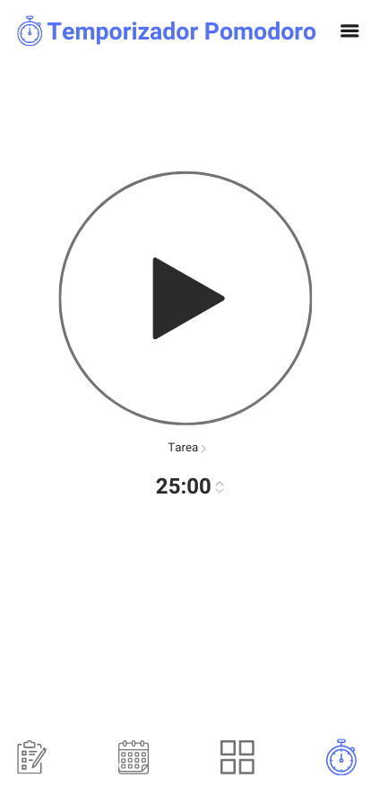
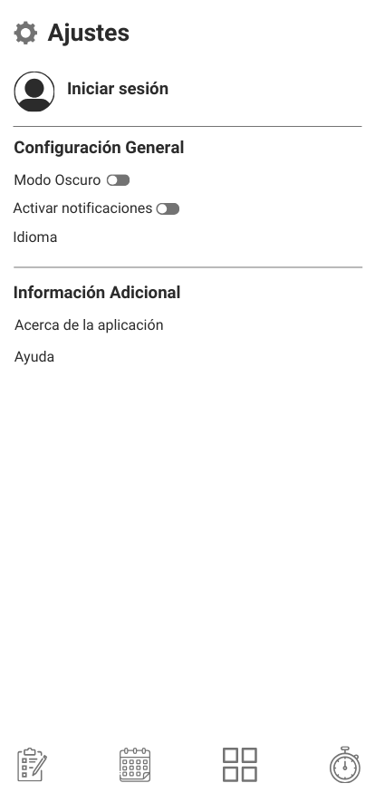
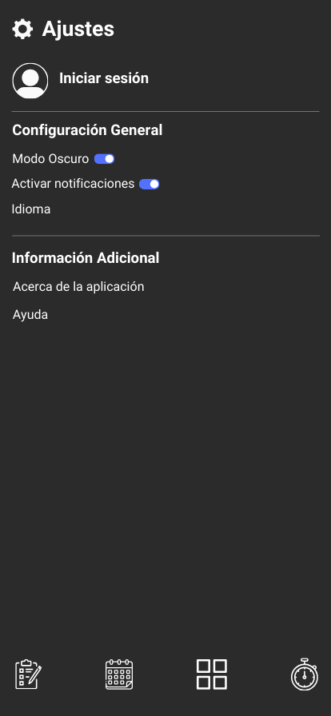

# Diseño de interfaz de usuario

El diseño interactivo y más completo de la UI de la aplicación puede encontrarse en Marvel App a través del siguiente enlace: [EasyTask UI](https://marvelapp.com/prototype/71idc9a).

A continuación, se presentan las pantallas principales que tendrá la aplicación:

**1. Inicio de sesión** 

Cuando el usuario ingrese a la aplicación podrá iniciar sesión de forma opcional por medio de su email o cuenta de Google. Si el usuario no desea iniciar sesión puede omitir dicha opción.

**2. Lista de tareas (Categorías)** 

La pantalla principal muestra cada una de las tareas agregadas por el usuario, inicialmente están ordenadas de acuerdo a las categorías que se hayan definido.

**3. Lista de tareas (Abrir tarea)** 

Al abrir o seleccionar una de las tareas de la lista, se abrirá una pequeña pestaña donde se podrán observar la respectiva descripción y fecha de entrega programada por el usuario. 

**4. Lista de tareas (Prioridad)** 

La lista de tareas también puede visualizarse según la prioridad temporal, independientemente de las categorías establecidas.

**5. Calendario (Vista por día)** 

Al ingresar a la sección de calendario el usuario podrá visualizar las tareas programadas para el día en sus respectivas horas.

**6. Calendario (Vista por semana)** 

El calendario también puede visualizarse a nivel semanal, lo cual permite una vista más general de las actividades en el tiempo.

**7. Matriz de Eisenhower** 

Al entrar en la sección de la matriz de Eisenhower es posible agrupar y visualizar las tareas de la lista en cada uno de los cuatro cuadrantes de esta matriz.

**8. Temporizador Pomodoro** 

En la sección del temporizador Pomodoro el usuario podrá activar o pausar el tiempo, además de personalizar el tiempo de cada ciclo según sus necesidades. 

**9. Ajustes (modo claro)** 

En el apartado de ajustes el usuario podrá personalizar la apariencia general de la aplicación (modo claro y oscuro), activar o desactivar las notificaciones, e iniciar sesión en caso de que haya omitido la opción.

**10. Ajustes (modo oscuro)** 

Al activar el modo oscuro, toda la aplicación cambia su apariencia.

